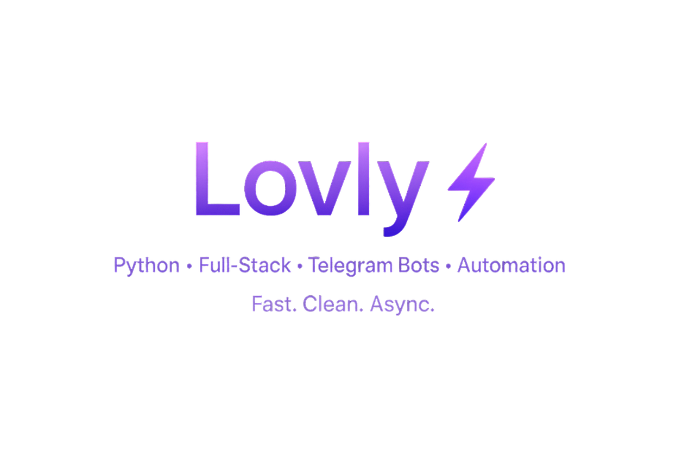

  
  
<h1 align="center">
  
  Hi, I'm <strong>Lovlygod</strong>
</h1>

<h3 align="center">Python Developer • Backend & Automation • API Tools</h3>

  I build fast backend tools, automation systems, and developer utilities.  
  I love turning ideas into small, useful, and scalable solutions.
   
  Always open to new friends, collaborations, and fun side-projects 🚀

---

## ⚡ What I Do

- 🐍 Backend development (APIs, async systems, microservices)  
- 🤖 Telegram bots, automation & integrations  
- 🔧 Developer tools that speed up building  
- 🧪 Fast experiments & prototypes  
- 🎯 Clean, simple and production-ready architecture  

---

## ⭐ Featured Projects

### 🔹 **[lovlyAPI](https://github.com/lovlygod/lovlyAPI)**
Fast and minimalistic API engine for rapid backend prototyping.  
**Tech:** Python, FastAPI

---

### 🔹 **[FragmentAPI](https://github.com/lovlygod/FragmentAPI)**
Modular API constructor inspired by microservice design.  
**Tech:** Python

---

### 🔹 **[ServiceMonitor](https://github.com/lovlygod/ServiceMonitor)**
Async uptime/status monitoring for services and endpoints.  
**Tech:** Async Python

---

### 🔹 **[Telegram-Buy-Stars](https://github.com/lovlygod/Telegram-Buy-Stars)**
Automation tool for Telegram Stars operations.  
**Tech:** Python, Telegram API

---

## 🧠 Tech Stack

  

---

## 🌱 Currently Learning

-  Go — high-performance backend  
-  Astro — modern web building  

---

## 🤝 Looking for Collaborators

I enjoy working with developers who like:

- automation  
- Python tooling  
- backend architectures  
- Telegram bots  
- experiment-driven development  

If you want to create something together —  
**feel free to write me anytime.**

---

## 📬 Contact

  

---

## 📊 GitHub Stats

  
  

  

---

  Made with ❤️ by Lovlygod — clean tools, real impact.

